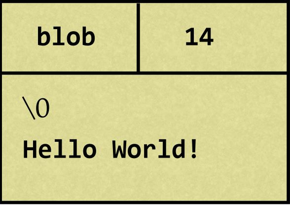
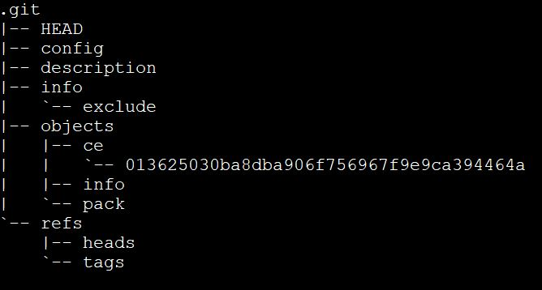
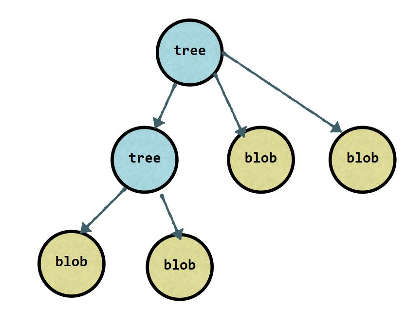
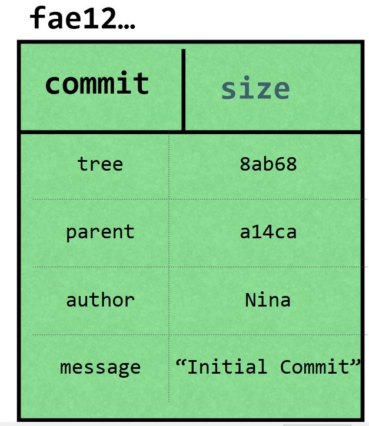
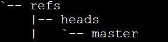

## Git basics

    - Distributed Version Control system.
    - Git is like a key value store.
    - Value =data and key = hash of the data.
    - Hashing algorithm is SHA1.
    - Key is 40 digit hexadecimal number.
    - This system is called a content addressable storage system.
    - Git store compressed data in blob along with meta data.
    - It uses null string delimiter \0. 

  

### Both command generate same hash output

```bash
echo 'Hello' | git hash-object --stdin
echo 'blob 5\0Hello' | openssl sha1
```

**.git** directory contains all of the data about the repository.
  
### command to store blob

```bash
# deleted hooks for simplification
rm -rf .git/hooks/
echo "hello" | git hash-object -w --stdin  
```  

### tree command

```bash
tree .git
```  



- blobs are stored inside objects.
- directory starts with first two character of the hash.

```bash
# pretty print the content
git cat-file -p ce013625030ba8dba906f756967f9e9ca394464a
# size of the content
git cat-file  -s ce013625030ba8dba906f756967f9e9ca394464a
# type of the content  either blob or tree
git cat-file  -t ce013625030ba8dba906f756967f9e9ca394464a
# command to add tree
git update-index --add --cacheinfo 100644 1f7a7a472abf3dd9643fd615f6da379c4acb3e3a test.txt
git write-tree
```

### tree contains few things

- blobs
- other tree

   

### and meta data

- type of pointer (blob or tree)
- file or directory name
- mode (executable file, symbolic link)

### modes in git lab

- 100644 normal file
- 100755 executable file
- 120000 symbolic link

### Commits are object

- it points to a tree.
- meta data contains author,date, message and parent commit( one or more).
- parent commit can be multiple in case of merge.
- commit is a code snapshot.
  
   

### this is where all the branches live



```bash
# list all logs in one line
git log --oneline
```

### head is usually a pointer to the current branch

if you are on branch pointer is the last commit

```bash
# list all logs in one line
> cat .git/refs/heads/master
8f6245b9d84107af98789e3946f197c87972a0d9
> cat .git/HEAD
ref: refs/heads/master
```

### Disable warning LF will be replaced by CLRF

``` bash
git config --local core.autocrlf false
```

### code lives in 3 working area

- working tree where all un tracked files live, it is not handled by git
- staging area ,files which are going to be the part of next commit
- repository area, files which git knows,contain all your commits
  
  ```bash
  # Show information about files in the index and the working tree
  > git ls-files -s
  100644 980a0d5f19a64b4b30a87d4206aade58726b60e3 0       hello.txt
  # to add file to staging area
  > git add <file>
  # to remove file
  > git rm <file>
  # to rename file
  > git mv <file>
  >
  >
# directly commit without putting in staging area

 > git commit -am "without intermediate step"
  ```

### allows you to stage commits in hunks,interactively

  ```bash
  > git add -p
  y - stage this hunk
  n - do not stage this hunk
  q - quit; do not stage this hunk or any of the remaining ones
  a - stage this hunk and all later hunks in the file
  d - do not stage this hunk or any of the later hunks in the file
  s - split the current hunk into smaller hunks
  e - manually edit the current hunk
  ? - print help
  ```

### git stash

- to save uncommitted work like switching between branches
- by default, git only stashes changes and file that are already **tracked**

  ```bash
  # add things to stash
  > git stash
  # list stash
  > git stash list
  # show the contents
  > git stash show stash@{0}
  # apply the last stash
  > git stash apply
  # apply a specific stash
  > git stash apply stash@{0}
  # keep un tracked files
  > git stash --include-untracked
  # keep all files (even ignored ones!)
  > git stash --all
  # name stashes for easy reference
  > git stash save "WIP: making some progress for new feature"
  # start a new branch from stash
  > git stash branch <optional stash name>
  # grab a single file from stash
  # use with caution, same filename in stage will be overwrite by this command
  > git checkout <stash name> -- <filename>
  ```

### cleaning the stash

- all stash information will be saved in .git/refs/stash file
  
 ```bash
 # remove the last stash and applying changes
 # does not remove if there is any merge conflict
 > git stash pop
 # remove the last stash
 > git stash drop  
 # remove the nth stash
 > git stash drop stash@{n}
 # remove all stashes
 > git stash clear
 ```

### git file diff

 ```bash
 > git diff <filename>
 ```

### References are pointer to commits,and there are 3 types of references

- Tags and Annotated Tags
- Branches
- HEAD

### Branch

- A branch is just a pointer to a particular commit
- New commits are made pointer will also change.

### Head

- How git knows what branch you are currently on,
- It is symbolic link to the branch that your currently working
- it is pointer
  - It usually point at the name of the current branch
  - But, it can point to a commit too (detached HEAD)
- It moves when
  - you make a commit in the currently active branch
  - When you checkout a new branch
  
### LIGHTWEIGHT TAGS

- Lightweight tags are just a simple pointer to a commit
- When you create a tag with no arguments, it captures the value
in HEAD

```bash
> git checkout master
> git tag my-first-commit
```

### ANNOTATED TAGS: GIT TAG -A

- Point to a commit, but store additional information
- Author, message, date

  ```bash
  # create annotated tag
  > git tag -a v1.0 -m 'version 1 from my blog'
  # List all the tags in a repo
  > git tag
  # List all tags, and what commit they’re pointing to
  > git show-ref --tags
  # Looking at the tag, or tagged contents:
  > git tag --points-at <commit>
  # Looking at the tag, or tagged contents:
  > git show <tag-name>


  ```
