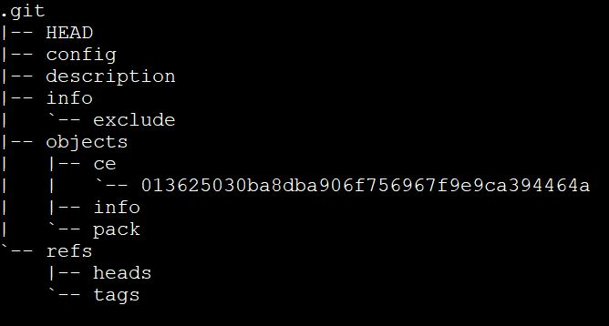

## Git basics
- Distributed Version Control system.
- Git is like a key value store.
- Value =data and key = hash of the data.
- Hashing algorithm is SHA1.
- Key is 40 digit hexadecimal number.
- This system is called a content addressable storage system.
- Git store data in blob along with meta data.
- It uses null string delimiter \0.
### Both command generate same hash output
```console
echo 'Hello' | git hash-object --stdin
echo 'blob 5\0Hello' | openssl sha1
```

- **.git** directory contains all of the data about the repository.
  
### command to store blob
```console
# deleted hooks for simplification
rm -rf .git/hooks/ 
echo "hello" | git hash-object -w --stdin  
```  
### tree command
```console
tree .git
```  

- blobs are stored inside objects. 
- directory starts with first two character of the hash.
```console
# pretty print the content
git cat-file -p ce013625030ba8dba906f756967f9e9ca394464a 
# size of the content
git cat-file  -s ce013625030ba8dba906f756967f9e9ca394464a 
# type of the content  either blob or tree
git cat-file  -t ce013625030ba8dba906f756967f9e9ca394464a
# command to add tree
git update-index --add --cacheinfo 100644 1f7a7a472abf3dd9643fd615f6da379c4acb3e3a test.txt 
git write-tree
```
### tree contains few things
- blobs
- other tree
### and meta data
  - type of pointer (blob or tree)
  - file or directory name
  - mode (executable file, symbolic link)

### modes in git lab
- 100644 normal file
- 100755 executable file
- 120000 symbolic link
